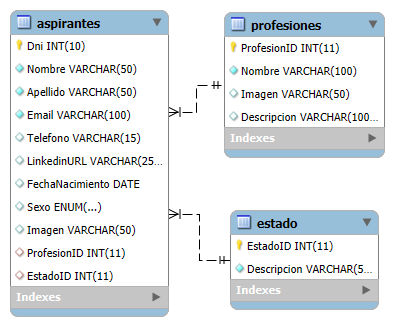

Documentacion

Modelo Entidad-Relacion

Nombre: Listado de todos los aspirantes.

Metodo:GET     Ruta: /applicants     

Descripcion: Se obtiene una lista de todos los aspirantes registrados en el sistema.

Nombre: Detalles de un aspirante

Metodo: GET     Ruta: /applicants/:id

Descripcion: Se obtiene los datos de un aspirante específico.

Nombre: Listado de todas las profesiones.

Metodo: GET     Ruta: /professions

Descripcion: Se obtiene una lista de todas las profesiones registradas en el sistema.

