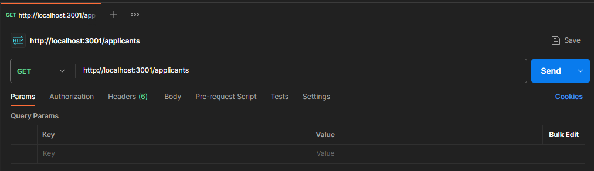
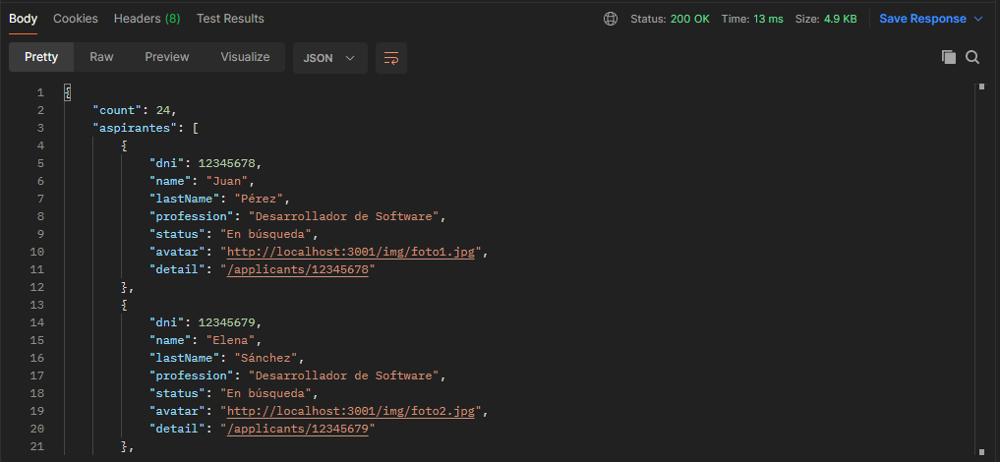
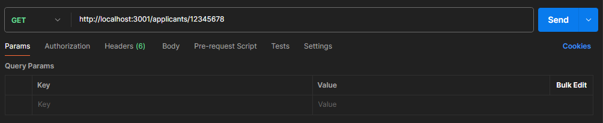
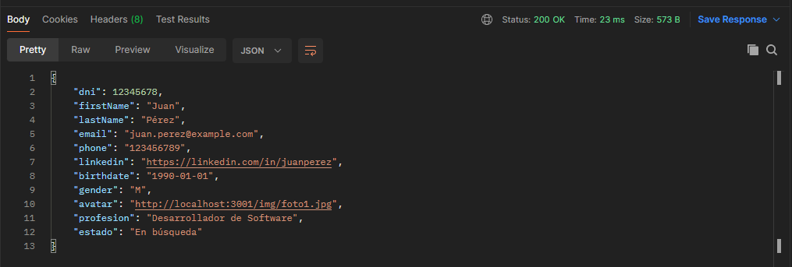
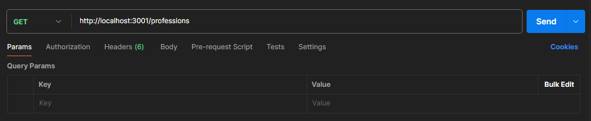
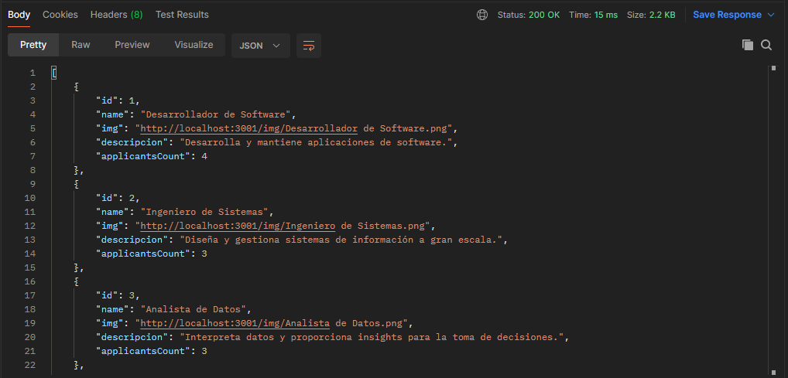

Documentacion

Modelo Entidad-Relacion

(Imagen)

Nombre: Listado de todos los aspirantes

Ruta:

Metodo:

Descripcion:

Nombre: Detalles de un aspirante

Ruta:

Metodo:

Descripcion:

Nombre: Listado de todas las profesiones

Ruta:

Metodo:

Descripcion:

